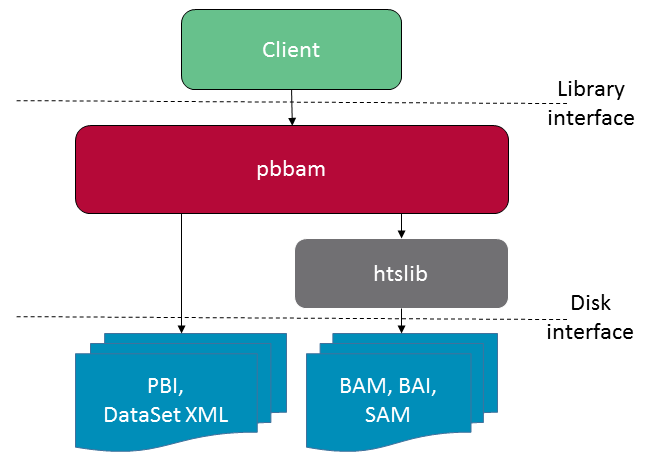

=============================================================
**Pbbam Core API Software Design & Functional Specification**
=============================================================
| *Version 0.2*
| *Pacific Biosciences Engineering Group*
| *Oct 17, 2016*

1. Revision History
===================

+-------------+---------------+--------------------+---------------------------------+
| **Date**    | **Revision**  | **Author(s)**      | **Comments**                    |
+=============+===============+====================+=================================+
| 01-29-2016  | 0.1           | Derek Barnett      | Initial draft created           |
|             |               |                    |                                 |
+-------------+---------------+--------------------+---------------------------------+
| 10-17-2016  | 0.2           | Derek Barnett      | Added behavioral representation |
|             |               |                    | and structural representation   |
|             |               |                    | diagram                         |
+-------------+---------------+--------------------+---------------------------------+

2. Introduction
===============

2.1. Document Specification Identifier
--------------------------------------

+-----------------------------------+------------------------------------------+
| **Document Specification Prefix** | **Description**                          |
+===================================+==========================================+
| FS\_SA\_PBBAM\_                   | Functional spec for pbbam                |
+-----------------------------------+------------------------------------------+

2.2. Purpose
------------

This document is intended to describe the requirements and interface of the pbbam
library, which provides functionality for creating, querying, and editing PacBio
BAM files and associated file formats.

2.3. Scope of Document
----------------------

This document covers the expected usage of the pbbam library, as well as any
desired or required performance characteristics with respect to quality or speed.

This document does not provide installation instructions or API documentation.

2.4. Glossary of Terms
----------------------

The table below specifies only terms specific to this document, and skips
acronyms/terms that are specified in `Pacific Biosciences Software Glossary`_.

.. _Pacific Biosciences Software Glossary: http://smrtanalysis-docs/pb_sw_glossary.html

+------------------+-----------------------------------------------------------+
| **Acronym/Term** | **Description**                                           |
+==================+===========================================================+
| API              | Application Programming Interface - a set of routines,    |
|                  | protocols, and tools for building software applications.  |
|                  | In this document, this will consist of one or more        |
|                  | cooperating libraries that specify data structures,       |
|                  | methods, etc. for use within a target programming         |
|                  | language.                                                 |
+------------------+-----------------------------------------------------------+
| Client           | An application that uses the library.                     |
+------------------+-----------------------------------------------------------+
| I/O              | Input/output of data.                                     |
+------------------+-----------------------------------------------------------+

2.5. References
---------------

+-------------+------------------------------+--------------------------------------+
| **Ref No.** | **Document Name, Link**      | **Description**                      |
+=============+==============================+======================================+
| (1)         | `BAM format`_                | General SAM/BAM specification        |
+-------------+------------------------------+--------------------------------------+
| (2)         | `PacBio BAM`_                | PacBio BAM specification             |
+-------------+------------------------------+--------------------------------------+
| (3)         | `PacBio BAM index`_          | PacBio BAM index specification       |
+-------------+------------------------------+--------------------------------------+
| (4)         | `DataSet XML`_               | PacBio DataSet XML specification     |
+-------------+------------------------------+--------------------------------------+
| (5)         | `Software Style Guide`_      | PacBio coding standards              |
+-------------+------------------------------+--------------------------------------+
| (6)         | `SMRT Analysis`_             | General SMRT Analysis infrastructure |
+-------------+------------------------------+--------------------------------------+

.. _BAM format: https://samtools.github.io/hts-specs/SAMv1.pdf
.. _PacBio BAM: http://pacbiofileformats.readthedocs.org/en/3.0/BAM.html
.. _PacBio BAM index: http://pacbiofileformats.readthedocs.org/en/3.0/PacBioBamIndex.html
.. _DataSet XML: https://github.com/PacificBiosciences/PacBioFileFormats/blob/3.0/DataSet.rst
.. _Software Style Guide: http://smrtanalysis-docs/_downloads/PBISoftwareStyleGuide.doc
.. _SMRT Analysis: http://smrtanalysis-docs/smrt_docs.html

3. Software Overview
====================

3.1. Software Module Description
--------------------------------

As of the 3.0 release of SMRT Analysis, PacBio is embracing the industry standard
`BAM format`_ (1) for (both aligned and unaligned) basecall data files. We have
also formulated a BAM companion file format (.bam.pbi) enabling fast access to a
richer set of per-read information as well as compatibility for software built
around the legacy cmp.h5 format.

The pbbam library provides components to create, query, & transform PacBio BAM
data: sequence files and their associated indices. This includes a core C++
library as well as bindings for additional programming languages.

3.2. Software Module Functional Capabilities
--------------------------------------------

The library must be able to read and write BAM files that conform to the
`PacBio BAM`_ specification (2). BAM records must be editable e.g. adding
alignment information. Random access must be supported, whether by genomic
region or by filtering record features. To this end, the library will be able to
read, write, and create associated index files - both the standard BAM index
(.bai) and the `PacBio BAM index`_ (.pbi) (3). In addition to working with
individual files, datasets of related BAM files will be supported. These are
described in a `DataSet XML`_ document. (4)

3.3. User Characteristics
-------------------------

+---------------------+--------------------------------------------------------+
| **User Class/Role** | **User Knowledge and Skill Levels**                    |
+=====================+========================================================+
| Developer           | Competence in one or more programming languages        |
|                     | supported (C++, R, Python, C#). No knowledge of        |
|                     | molecular biology wet lab techniques required.         |
+---------------------+--------------------------------------------------------+

3.4. User Operations and Practices
----------------------------------

Developer users will interact with the software by incorporating the library
into a client application.

3.5. Operating Environment
--------------------------

The software is intended to be run in a Linux or OSX environment, with ideally 4
or more cores.

3.6. General Constraints
------------------------

Currently there are no constraints outside the operating environment and speed
requirements. In particular, as the library will be used for writing the BAM
files coming off a Sequel instrument, it should be able to keep pace.

3.7. Assumptions and Dependencies
---------------------------------

Input routines for the library will expect to receive files that conform to the
`PacBio BAM`_ (2) or `DataSet XML`_ (4) specifications.

The pbbam library depends on Boost, zlib, and htslib libraries.

3.8. Other Software
-------------------

Output PacBio BAMs will be compatible with the `PacBio BAM`_ specification (2)
and thus compatible with the general `BAM format`_ specification (1). This
ensures that a wide variety of downstream tools can interact with data files.

The software uses `CMake`_ as its build system.

The core C++ API relies on the following 3rd party components:

* `zlib`_
* `htslib`_
* `Boost`_ (header-only modules)

Wrapper APIs for additional languages (Python, R, C#) are generated by `SWIG`_.

API documentation is generated via `Doxygen`_.

.. _CMake: https://cmake.org/
.. _zlib: http://www.zlib.net/
.. _htslib: https://github.com/samtools/htslib
.. _Boost: http://www.boost.org/
.. _SWIG: http://www.swig.org/
.. _Doxygen: http://www.stack.nl/~dimitri/doxygen/

4. External Interfaces
======================

4.1. User Interfaces
--------------------

N/A

4.2. Software Interfaces
------------------------

pbbam will require the following software:

* `htslib`_ & `zlib`_ - provides low-level handling of compressed BAM data
* `Boost`_ - provides utility classes

Incoming data from upstream components will be compliant with
PacBio BAM format - see `PacBio BAM`_ specification (2) for more detail.

4.3. Hardware Interfaces
------------------------

N/A

4.4. Communications Interfaces
------------------------------

N/A

5. Functional Requirements
==========================

5.1. Query BAM data by genomic region
-------------------------------------

5.1.1. Description
~~~~~~~~~~~~~~~~~~

pbbam shall allow client applications to query data, limited to some genomic
region of interest.

5.1.2. Inputs
~~~~~~~~~~~~~

* BAM file(s) or DataSet XML
* a standard index (.bai) for each source BAM file
* genomic interval (e.g. "chr1:1000-2000")

5.1.3. Processing
~~~~~~~~~~~~~~~~~

Obtain an `htslib`_ "iterator" object for a given file and region. This will be
wrapped by pbbam to hide the low-level nature of this type, as well as handling
memory lifetime.

5.1.4. Outputs
~~~~~~~~~~~~~~

Iterator providing access to individual BAM records from the input data sources,
which are aligned to the requested genomic interval.

For example:

.. code:: c++

    GenomicIntervalQuery query(interval, dataset);
    for (const BamRecord& record : query) {
        // ... use record data ...
    }

5.2. Query BAM data by filter criteria
--------------------------------------

5.2.1. Description
~~~~~~~~~~~~~~~~~~

pbbam shall allow client applications to query data, limited to some filter
criteria (e.g. only reads from ZMW hole number 200 with a read quality of >0.5).

5.2.2. Inputs
~~~~~~~~~~~~~

* BAM file(s) or DataSet XML
* a `PacBio BAM index`_ (.pbi) for each source BAM file
* filters supported by data contained in the PBI

5.2.3. Processing
~~~~~~~~~~~~~~~~~

Query PBI files(s) for records that match the provided filter criteria. Merge
contiguous runs of records into record blocks, to minimize seeks. Advancing the
iterator either reads the next read from the current block or seeks to the next
block and fetches the next record.

5.2.4. Outputs
~~~~~~~~~~~~~~

Iterator providing access to individual BAM records from the input data sources,
which satisfy the requested filter criteria.

For example:

.. code:: c++

    PbiFilterQuery query(filter, dataset);
    for (const BamRecord& record : query) {
        // ... do stuff ...
    }

5.3. Write PacBio BAM data
--------------------------

5.3.1. Description
~~~~~~~~~~~~~~~~~~

pbbam shall be able to write `PacBio BAM`_ files conforming to the specification.

5.3.2. Inputs
~~~~~~~~~~~~~

* filename
* header information
* BAM records

5.3.3. Processing
~~~~~~~~~~~~~~~~~

Create file handle for the provided filename, output initial header information.
As records are passed in, write to file. Upon completion, flush any buffers and
close file handle.

Multithreading, provided by `htslib`_, will be utilized where possible to speed
up the compression process - often then main bottleneck of BAM throughput.

5.3.4. Outputs
~~~~~~~~~~~~~~

BAM file conforming to the `PacBio BAM`_ specification.

5.4. Create PacBio BAM index file
---------------------------------

5.4.1. Description
~~~~~~~~~~~~~~~~~~

Much of PacBio BAM data processing relies on the presence of a `PacBio BAM index`_
file. pbbam shall be able to generate this file type for a `PacBio BAM`_ file.

5.4.2. Inputs
~~~~~~~~~~~~~

`PacBio BAM`_ file

5.4.3. Processing
~~~~~~~~~~~~~~~~~

Read through the input BAM records, storing the values relevant to a PBI index.
At end of file, write the index contents to a file and close.

5.4.4. Outputs
~~~~~~~~~~~~~~

`PacBio BAM index`_ file

6. Non-Functional Requirements
==============================

6.1. Performance Requirements
-----------------------------

Since pbbam will be used to write all BAM files coming off a Sequel instrument, the
library must keep pace with data generation requirements.

6.2. Safety Requirements
------------------------

N/A

6.3. Security Requirements
--------------------------

N/A

6.4. Quality Attributes
-----------------------

6.4.1. Availability
~~~~~~~~~~~~~~~~~~~

The developed software shall meet the overall product availability requirements.

6.4.2. Data Integrity
~~~~~~~~~~~~~~~~~~~~~

Inputs and outputs shall adhere to the PacBio BAM or DataSet XML specifications.
Files that do not meet this requirement will raise exceptions and will not be
accepted.

6.4.3. Interoperability
~~~~~~~~~~~~~~~~~~~~~~~

Inputs and outputs shall adhere to the PacBio BAM or DataSet XML specifications.

6.4.4. Reliability
~~~~~~~~~~~~~~~~~~

The developed software shall meet the overall product reliability requirements.

6.4.5. Robustness
~~~~~~~~~~~~~~~~~

pbbam will raise exceptions upon encountering failure cases, allowing client
applications to recover or report the error to a UI.

6.4.6. Usability
~~~~~~~~~~~~~~~~

pbbam shall have comprehensive API documentation, available both on- and offline.
Further documentation will be provided for installation, API usage tips, etc.

Raised exceptions shall carry as much information as possible so that client
applications can respond with appropriate actions or display useful messages.

6.4.7. Maintainability
~~~~~~~~~~~~~~~~~~~~~~

The source code of the software covered in this functional specification shall
adhere to the PacBio `Software Style Guide`_ (9) work instruction, to guarantee
high quality of code that facilitates maintainability.

6.4.8. Customizability
~~~~~~~~~~~~~~~~~~~~~~

N/A

6.4.9. Compatibility
~~~~~~~~~~~~~~~~~~~~

pbbam shall support backward compatibility of the API and BAM format versions
in order not to break existing clients.

6.5. Business Rules
-------------------

N/A

6.6. Compliance Requirements
----------------------------

N/A

6.7. Alarms and Error Handling
------------------------------

Raised exceptions shall carry as much information as possible so that client
applications can respond with appropriate actions or display useful messages.

6.8. Persistence Requirements
-----------------------------

pbbam software requires no persistent storage outside of availability of input
and output during analysis.

6.9. Installation and Upgrade
-----------------------------

Installation and Upgrade of this software will be handled as part of the SMRT
Analysis subsystem. See `SMRT Analysis`_ (6) specifications for more detail.

Additionally, the library may be built independently, either from internal
version control (Perforce) or from the public-facing Github repository. In
either case, `CMake`_ is used to drive the build process.

6.10. Administration and Maintenance
------------------------------------

N/A

6.11. User Documentation
------------------------

pbbam shall have comprehensive API documentation, available both on- and offline.
Further documentation will be provided for installation, API usage tips, etc.

The "offline" API documentation may be built directly from the source code, using
`Doxygen`_. Online documentation will be generated via a continuous integration
server, thus ensuring it is always pointing to the current codebase.

7. High Level Design
====================

7.1. Top Level Context
----------------------

The pbbam library is intended to be linked in with client applications,
providing programmatic access to data files.

7.2. Use Cases
--------------

Primary use cases for pbbam include:

* BAM file creation
* BAM file query - iterable access to various subsets of data

8. Detailed Design
==================

8.1. Structural Representation
------------------------------

8.2. Behavioral Representation
------------------------------

The typical access pattern involves a client query against BAM data, optionally
described in DataSet XML. The query may involve some number of filter criteria.

pbbam queries the associated index files (*.pbi) to pre-determine which records
pass filtering criteria and where they reside on disk. The client code is given
an iterable object, such that each iteration of the main access loop returns a
valid BAM record for analysis, modification, etc.

8.3. Information Storage
------------------------

pbbam software requires no persistent storage outside of availability of input
and output during analysis.

8.4. Technology Overview
------------------------

pbbam is implemented in C++-11 and should perform as designed on any UNIX-like
operating system (Linux distributions, Apple OSX, etc.).

8.5. SOUP Components
--------------------

pbbam utilizes CMake for its build system. The C++ library uses the following
3rd-party software components: `Boost`_, `htslib`_, & `zlib`_. Wrappers for additional
languages are generated using SWIG.

8.6. Deployment and Configuration
---------------------------------

Please refer to `SMRT Analysis`_ (6) documentation

9. Automated Tests
==================

9.1. Unit Testing
-----------------

The library shall have unit tests for all classes & components.

9.2. Performance Testing
------------------------

Unit tests may evaluate performance requirements as desired.

9.3. Regression Testing
-----------------------

As its role is primarily in data I/O, pbbam has no "scientific quality/validity"
metrics that would indicate a regression. Instead, passing its unit tests and
end-to-end tests will indicate that a regression has not been introduced.

These tests will be run after each check-in and nightly.

10. Requirements Traceability Matrices
======================================

This section provides traces from requirements specified in PRD/DIR documents to the
requirements covered in this functional specification, and from these
functional requirements to corresponding Test Cases/Procedures.

10.1. HPQC Functional Specifications
------------------------------------

+-------------+---------------------------+---------------------------------------------------+-------------+------------+-----------+--------------------------------------------------+
| **PBI_ID**  | **Name**                  | **Description**                                   | **Comment** | **Metric** | **Owner** | **PRD/DIR Path**                                 |
+=============+===========================+===================================================+=============+============+===========+==================================================+
| 5.1         | Query BAM data by         | pbbam shall allow client applications to query    |             | Yes        | dbarnett  | \\DIR\\Functionality\\Software\Common\APIs\\     |
|             | genomic region            | data, limited to some genomic region of interest. |             |            |           | Software shall provide an API to allow 3rd       |
|             |                           |                                                   |             |            |           | party software to extract all run information    |
|             |                           |                                                   |             |            |           | including summary reports and locations          |
+-------------+---------------------------+---------------------------------------------------+-------------+------------+-----------+--------------------------------------------------+
| 5.2         | Query BAM data by         | pbbam shall allow client applications to query    |             | Yes        | dbarnett  | \\DIR\\Functionality\\Software\Common\APIs\\     |
|             | filter criteria           | data, limited to some filter criteria (e.g. only  |             |            |           | Software shall provide an API to allow 3rd       |
|             |                           | reads from ZMW hole number 200 with a read        |             |            |           | party software to extract all run information    |
|             |                           | quality of >0.5).                                 |             |            |           | including summary reports and locations          |
+-------------+---------------------------+---------------------------------------------------+-------------+------------+-----------+--------------------------------------------------+
| 5.3         | Write PacBio BAM data     | pbbam shall be able to write files conforming to  |             | Yes        | dbarnett  | \\DIR\\Functionality\\Software\\PostProcessing\\ |
|             |                           | the `PacBio BAM`_ specification.                  |             |            |           | Software shall provide base files including      |
|             |                           |                                                   |             |            |           | kinetic information in industry standard format  |
|             |                           |                                                   |             |            |           | such as SAM/BAM using current specifications     |
+-------------+---------------------------+---------------------------------------------------+-------------+------------+-----------+--------------------------------------------------+
| 5.4         | Create PacBio BAM index   | Much of PacBio BAM data processing relies on the  |             | Yes        | dbarnett  | \\DIR\\Functionality\\Software\\PostProcessing\\ |
|             | file                      | presence of a `PacBio BAM index`_ file. pbbam     |             |            |           | Software shall provide base files including      |
|             |                           | shall be able to generate this file type for a    |             |            |           | kinetic information in industry standard format  |
|             |                           | `PacBio BAM`_ file.                               |             |            |           | such as SAM/BAM using current specifications     |
+-------------+---------------------------+---------------------------------------------------+-------------+------------+-----------+--------------------------------------------------+

10.2. Automated Tests Coverage
------------------------------

+-------------+---------------------------+----------------------------------------------------+------------------------------------------------------------------+
| **FS Item** | **FS Item Title**         | **Use Case Description**                           | **Test Case Name/ID**                                            |
+=============+===========================+====================================================+==================================================================+
| 5.1         | Query BAM data by         | pbbam shall allow client applications to query     | See section 9.1. Unit Testing.                                   |
|             | genomic region            | data, limited to some genomic region of interest.  |                                                                  |
+-------------+---------------------------+----------------------------------------------------+------------------------------------------------------------------+
| 5.2         | Query BAM data by         | pbbam shall allow client applications to query     | See section 9.1. Unit Testing.                                   |
|             | filter criteria           | data, limited to some filter criteria (e.g. only   |                                                                  |
|             |                           | reads from ZMW hole number 200 with a read         |                                                                  |
|             |                           | quality of >0.5).                                  |                                                                  |
+-------------+---------------------------+----------------------------------------------------+------------------------------------------------------------------+
| 5.3         | Write PacBio BAM data     | pbbam shall be able to write files conforming to   | See section 9.1. Unit Testing.                                   |
|             |                           | the `PacBio BAM`_ specification.                   |                                                                  |
+-------------+---------------------------+----------------------------------------------------+------------------------------------------------------------------+
| 5.4         | Create PacBio BAM index   | Much of PacBio BAM data processing relies on the   | See section 9.1. Unit Testing.                                   |
|             | file                      | presence of a `PacBio BAM index`_ file. pbbam      |                                                                  |
|             |                           | shall be able to generate this file type for a     |                                                                  |
|             |                           | `PacBio BAM`_ file.                                |                                                                  |
+-------------+---------------------------+----------------------------------------------------+------------------------------------------------------------------+

